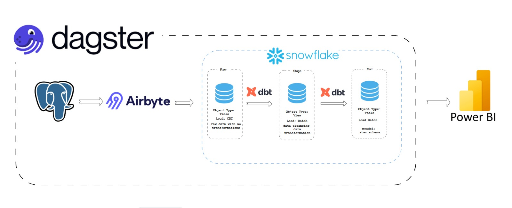
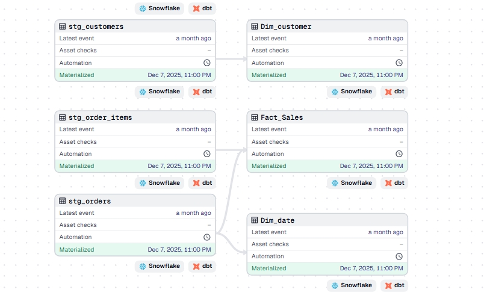
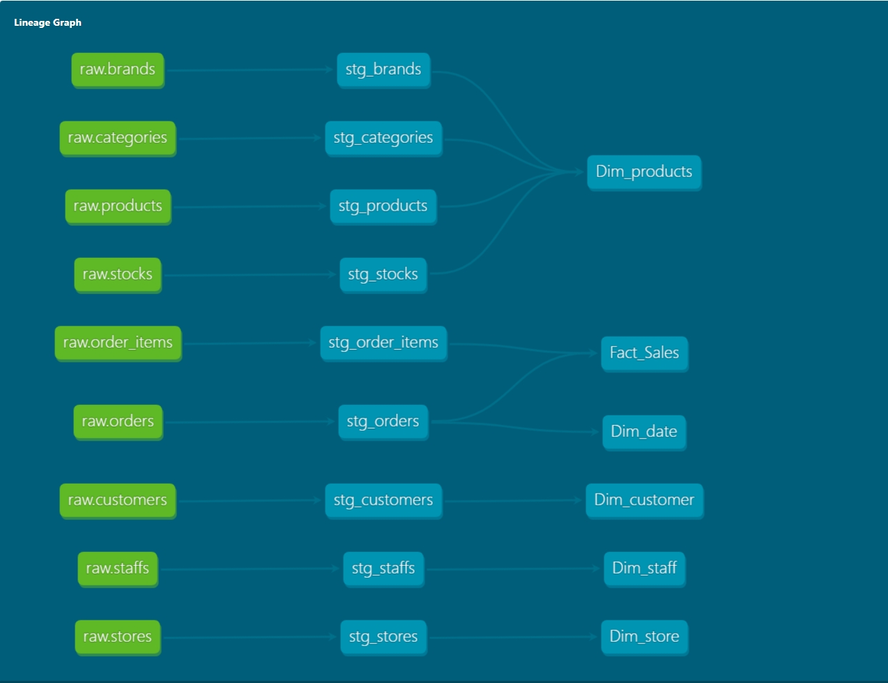

# 🚲 BikeStore End-to-End Data Engineering Project

Data pipeline using the Modern Data Stack. It automates the flow of data from a transactional PostgreSQL database into a Snowflake Data Warehouse, applying transformations through dbt and managing the entire lifecycle with Dagster.
---

## 🏗️ Architecture & Flow
The project follows a robust data lifecycle:
1. **Source:** Transactional data stored in **PostgreSQL**.
2. **Ingestion (EL):** **Airbyte** extracts data and loads it into **Snowflake** (Raw Layer).
3. **Transformation (T):** **dbt** organizes data into **Bronze, Silver, and Gold** layers.
4. **Orchestration:** **Dagster** manages the end-to-end workflow, ensuring data quality and lineage.

 
---

## 🛠️ Tech Stack
| Tool | Purpose |
| :--- | :--- |
| **PostgreSQL** | Source OLTP Database |
| **Airbyte** | Data Ingestion (EL) |
| **Snowflake** | Cloud Data Warehouse |
| **dbt (Core)** | Data Transformation & Modeling |
| **Dagster** | Workflow Orchestration & Data Assets Management |
| **SQL** | Core logic for transformations |

---

*  ## 🚀 Key Features
* **CDC (Change Data Capture):** Implemented using Airbyte and Postgres WAL logs for efficient, low-latency incremental data updates.
* **Incremental Loads:** Optimized data processing using dbt incremental models to reduce warehouse costs.  
* **Data Quality:** Implementation of dbt tests (unique, not_null, relationships).
  
* **Observability:** Used Dagster UI to monitor asset health and execution logs. 

* **Modularity**: Clean, reusable SQL code using dbt macros and sources.

## 🧠 Medallion Architecture (dbt Models)
I implemented a **Medallion Architecture** to ensure data reliability:

* **🥉 Bronze (Raw):** Direct ingestion from Airbyte. No transformations, just raw history.
* **🥈 Silver (Cleaned):** Data cleaning, handling nulls, renaming columns for consistency, and casting data types.
* **🥇 Gold (Curated):** Business-ready tables. Fact and Dimension tables (Star Schema) optimized for BI and analytics.

---

## ⚙️ Project Structure
```bash
.
├── dataset/             # data source 
├── dagster_project/     # Dagster code, assets, and schedules
├── bikestore_project/         # dbt models, macros, and tests
│   ├── models/
│   │   ├── raw/     # Bronze
│   │   ├── stageing/# Silver
│   │   └── marts/        # Gold
├── assets/              # Screenshots and Architecture diagrams
├── dashboard/              # Screenshots and Architecture diagrams
└── README.md
```
##📊 Pipeline Monitoring
Dagster Lineage
This view shows the dependencies between Airbyte syncs and dbt models.



dbt Documentation & Lineage
Automated documentation generated for all data models.



## 👤 Author
Mohamed AbdelGawad

LinkedIn: (https://www.linkedin.com/in/mahmoud-abdel-gawad/)
